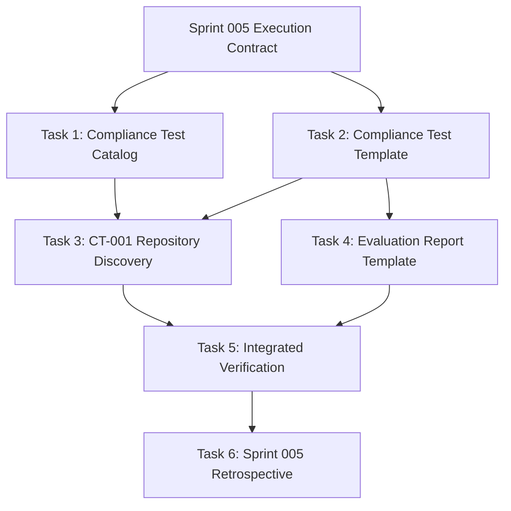

# Sprint 005 Canonical Execution Plan

**Status:** Canonical Execution Plan  
**Version:** 1.0  
**Date:** 2026-07-02  
**Primary Authority:** `engineering/execution_contracts/sprint_005_execution_contract.md`  
**Derived From:** Independent engineering execution proposals reviewed during Sprint 005 from Codex, Antigravity, and Gemini.

---

## 1. Purpose

This document is the repository's canonical execution plan for Sprint 005 Phase B.

It consolidates the strongest engineering elements from the independent execution proposals while remaining fully subordinate to the approved Sprint 005 Execution Contract.

The purpose of this plan is to provide a single implementation-ready execution sequence that can be reviewed and executed by any qualified contributor, including independent AI contributors starting from a cold session.

This document does not change the approved Sprint 005 scope.

This document does not authorize any work beyond the Sprint 005 Execution Contract.

---

## 2. Authoritative Scope

The approved Sprint 005 Execution Contract remains the sole authority for:

- approved deliverables;
- approved repository paths;
- scope boundaries;
- TIA conclusions;
- validation requirements;
- rollback rules;
- stop-work and re-approval conditions.

If this Canonical Execution Plan conflicts with the approved Execution Contract, the Execution Contract prevails.

---

## 3. Repository Inspection Summary

Sprint 005 Phase B operationalizes the existing governance architecture:

```text
Repository Governance Validation (RGV)
        ↓
Repository Governance Assurance Model (RGAM)
        ↓
AI Compliance Test Framework (ACTF)
        ↓
Compliance Test Catalog, CT-001, and Evaluation Report Template
```

Phase A governance foundation artifacts already exist and are implementation inputs.

They are not deliverables to recreate or modify.

---

## 4. Approved Deliverables

Sprint 005 Phase B is limited to creating the following repository files:

1. `docs/governance/compliance_tests/README.md`
2. `docs/governance/compliance_tests/compliance_test_template.md`
3. `docs/governance/compliance_tests/CT-001-repository-discovery.md`
4. `docs/governance/templates/evaluation_report_template.md`
5. `docs/retrospectives/retrospective_sprint_005.md`

The first four files are implementation deliverables.

The retrospective is created only after implementation and verification are complete.

---

## 5. Explicit Out-of-Scope Items

The following are outside Sprint 005 Phase B:

- runtime implementation;
- modifications under `src/`;
- modifications under `tests/`;
- parser, renderer, repository, model, importer, GUI, or workspace changes;
- scripts or automated compliance tooling;
- hooks;
- CI changes;
- execution of CT-001;
- production of any actual compliance evaluation report;
- Sprint 006 planning or execution;
- modification of existing governance authorities unless the Execution Contract is formally revised and re-approved.

Existing governance files are read-only implementation inputs.

---

## 6. Execution Dependency Graph



Tasks 1 and 2 may begin independently after authorization.

Task 3 depends on both Task 1 and Task 2.

Task 4 depends on Task 2.

Task 5 depends on Tasks 1–4.

Task 6 depends on successful Task 5 verification.

---

## 7. Governance Considerations

Tasks 1–4 are Class B changes.

Their Testing Impact Analysis has already been approved in the Sprint 005 Execution Contract.

Task 5 is verification and does not itself modify repository behavior.

Task 6 is a closing retrospective and records completed outcomes rather than defining new governance behavior.

No contributor may reinterpret the approved TIA during implementation.

If actual implementation invalidates an approved TIA entry, work must stop and the Execution Contract must be revised and re-approved before continuing.

---

## 8. Execution Strategy

Execution follows a strict dependency order:

1. Establish the catalog and template.
2. Define CT-001 using the template and catalog conventions.
3. Create the evaluation report template based on ACTF evidence and result semantics.
4. Verify the four governance assets as one integrated system.
5. Create the retrospective using actual verification evidence.

The execution strategy emphasizes:

- strict scope control;
- repository-first terminology;
- traceability to existing governance authorities;
- no hidden reliance on prior conversation context;
- no runtime implementation;
- no compliance evaluation execution;
- no unauthorized governance architecture changes.

---

## 9. Task 1 — Compliance Test Catalog

### Objective

Create the authoritative catalog entry point for repository governance compliance tests.

### File to Create

`docs/governance/compliance_tests/README.md`

### Deliverable

A Markdown catalog that:

- identifies ACTF as the authority for compliance-test methodology;
- explains the purpose of the compliance test catalog;
- defines naming and organization conventions for compliance test files;
- indexes CT-001 by identifier, title, governance property, and relative link;
- distinguishes test definitions from test executions and evaluation reports.

### Completion Criteria

Task 1 is complete when:

- the catalog exists at the exact approved path;
- CT-001 is indexed with a valid relative link;
- the catalog does not redefine RGV, RGAM, ACTF, the engineering workflow, or evaluation-report responsibilities;
- the catalog can be understood by a contributor starting from a cold repository session.

### Verification Activities

- Check relative links.
- Check terminology against ACTF.
- Check responsibility boundaries against governance architecture.
- Confirm no existing governance authority is duplicated or rewritten.

---

## 10. Task 2 — Compliance Test Template

### Objective

Translate ACTF's compliance-test structure into a reusable authoring template.

### File to Create

`docs/governance/compliance_tests/compliance_test_template.md`

### Deliverable

A Markdown template that includes all ACTF-required compliance test fields:

- Identifier;
- Objective;
- Governance Property;
- Repository Artifacts;
- Initial Conditions;
- Evaluation Procedure;
- Expected Observable Behavior;
- Required Evidence;
- Pass Criteria;
- Failure Indicators;
- Possible Inconclusive Conditions.

### Completion Criteria

Task 2 is complete when:

- every ACTF-required field is explicitly present;
- evidence requirements are distinct from expected behavior;
- PASS, FAIL, and INCONCLUSIVE are the only result states;
- the template remains contributor-independent;
- the template does not introduce scoring or model-intelligence evaluation.

### Verification Activities

- Perform field-by-field ACTF traceability review.
- Confirm result-state terminology.
- Confirm contributor-independent wording.
- Confirm no hidden reasoning or internal model state is required.

---

## 11. Task 3 — CT-001 Repository Discovery

### Objective

Define the repository's first operational compliance test for repository-governance discoverability.

### File to Create

`docs/governance/compliance_tests/CT-001-repository-discovery.md`

### Deliverable

A complete CT-001 test definition that evaluates whether a contributor can discover the repository's engineering entry points and governance workflow from repository artifacts alone.

### Completion Criteria

Task 3 is complete when CT-001:

- conforms to the Compliance Test Template;
- maps explicitly to RGAM GP-001 Discoverability;
- uses repository-only initial conditions;
- excludes hidden conversation history and unpublished knowledge;
- evaluates observable contributor behavior;
- identifies concrete required evidence;
- defines distinguishable PASS, FAIL, and INCONCLUSIVE conditions;
- remains a test definition only and is not executed during Sprint 005.

### Verification Activities

- Check template conformance.
- Check GP-001 mapping.
- Perform dry structural walkthrough.
- Confirm no actual compliance evaluation is claimed.
- Confirm evidence can be collected without internal reasoning disclosure.

---

## 12. Task 4 — Evaluation Report Template

### Objective

Create a reusable template for recording compliance-test execution evidence and results.

### File to Create

`docs/governance/templates/evaluation_report_template.md`

### Deliverable

A Markdown evaluation report template that records:

- evaluation identifier;
- evaluation date;
- repository snapshot;
- governance artifact versions;
- contributor type;
- evaluation environment;
- procedure observations;
- evidence record;
- criterion-level analysis;
- exactly one final result state: PASS, FAIL, or INCONCLUSIVE;
- governance findings;
- limitations;
- follow-up actions.

### Completion Criteria

Task 4 is complete when:

- the template captures enough information to reproduce and review a compliance result;
- it supports CT-001 but remains generic for future compliance tests;
- it does not redefine ACTF methodology;
- it does not create an actual evaluation report;
- it does not introduce states beyond PASS, FAIL, and INCONCLUSIVE.

### Verification Activities

- Trace report fields to ACTF evaluation requirements.
- Perform structural compatibility walkthrough with CT-001.
- Confirm no actual CT-001 execution is represented.
- Confirm finding fields do not replace the Governance Finding Registry.

---

## 13. Task 5 — Integrated Verification

### Objective

Verify that the four Phase B governance assets form a consistent, bounded, and contract-compliant governance asset set.

### Files Modified

None.

Task 5 inspects repository state but does not create or modify repository files.

### Required Verification Checks

Task 5 shall verify:

1. All four Phase B assets exist at exact approved paths.
2. No unauthorized files were created.
3. No existing files were modified.
4. No runtime, scripts, tests, hooks, or CI files changed.
5. Relative Markdown links resolve.
6. ACTF field traceability is complete.
7. CT-001 maps to GP-001.
8. CT-001 uses observable behavior and repository-only initial conditions.
9. Evaluation Report Template supports CT-001 structurally.
10. No compliance test execution is claimed.
11. PASS, FAIL, and INCONCLUSIVE are the only result states.
12. Existing `pytest` regression baseline completes, or any inability to run it is explicitly recorded.
13. Final repository diff contains only authorized Sprint 005 Phase B paths.

### Verification Evidence

The verification process shall preserve:

- validation checklist results;
- final repository diff;
- link review results;
- ACTF traceability review results;
- cold-start review observations;
- structural walkthrough observations;
- `pytest` command and result;
- governance findings and their disposition.

Verification evidence shall be referenced by the Sprint 005 Retrospective.

---

## 14. Task 6 — Sprint 005 Retrospective

### Objective

Close Sprint 005 with a factual retrospective based on completed implementation and verification evidence.

### File to Create

`docs/retrospectives/retrospective_sprint_005.md`

### Deliverable

A retrospective that records:

- Sprint 005 objective;
- implemented deliverables;
- verification results;
- deviations, if any;
- governance findings;
- unresolved follow-up items;
- evidence references;
- lessons learned;
- recommendation for Sprint 006.

### Completion Criteria

Task 6 is complete when:

- it is created only after Task 5 verification;
- it records actual outcomes rather than planned outcomes;
- it identifies whether deviations occurred;
- it references verification evidence;
- it carries forward unresolved non-blocking findings without expanding Sprint 005 scope.

### Verification Activities

- Compare retrospective claims against actual repository diff.
- Confirm references to verification evidence.
- Confirm open governance findings are accurately listed.
- Confirm no new implementation scope is introduced.

---

## 15. Risk Controls

### Authorized-Path Allowlist

Implementation is limited to the five approved deliverable paths listed in Section 4.

Any change outside those paths requires stop-work and re-approval.

### Read-Only Authorities

The following are read-only during Sprint 005 Phase B implementation:

- Engineering Governance Policy;
- Engineering Contributor Guide;
- Governance Architecture;
- Repository Governance Validation;
- Repository Governance Assurance Model;
- AI Compliance Test Framework;
- approved Sprint 005 Execution Contract.

### Stop-Work Triggers

Work must stop immediately if:

- an existing governance artifact requires modification;
- a new unapproved file becomes necessary;
- an approved completion criterion cannot be satisfied;
- an approved TIA entry becomes invalid;
- a runtime or automation change appears necessary;
- a compliance evaluation must be executed to proceed;
- an evaluation report would need to be produced;
- implementation would exceed the approved contract.

### Re-Approval Requirement

If stop-work is triggered, work may resume only after:

1. the issue is documented;
2. the Execution Contract is revised if needed;
3. Architecture Owner approval is obtained.

---

## 16. Validation Strategy

### Repository Consistency

- Confirm exact authorized file paths.
- Confirm no existing files changed.
- Confirm no runtime files changed.
- Confirm final diff matches the Execution Contract.
- Run the repository verification baseline, including `pytest` where applicable.

### Governance Consistency

- Preserve RGV as the source of why governance is validated.
- Preserve RGAM as the source of what governance properties are assured.
- Preserve ACTF as the source of how compliance tests are structured and evaluated.
- Preserve the catalog as the index of test definitions.
- Preserve the evaluation report template as evidence-recording structure only.

### Documentation Consistency

- Verify links.
- Verify terminology.
- Verify field-level traceability.
- Verify no duplication of authority.
- Verify no circular authority.

### Cold-Start Usability

A future contributor starting from a cold session should be able to locate:

- the compliance test catalog;
- the compliance test template;
- CT-001;
- the evaluation report template;
- the governing RGV, RGAM, and ACTF documents.

---

## 17. Repository Compliance Rule

Implementation contributors shall execute this plan exactly as written.

They shall not:

- rewrite the plan;
- change task order without reason;
- add new deliverables;
- modify existing governance authorities;
- introduce automation;
- execute CT-001;
- create evaluation reports;
- make runtime changes.

Optional improvements discovered during execution shall be recorded as governance findings or retrospective observations rather than implemented without authorization.

---

## 18. Independent Feasibility Review Request

Before implementation, independent reviewers shall determine whether this plan is executable exactly as written.

Reviewers shall answer:

1. Is every task executable?
2. Are dependencies correct?
3. Are any implementation details missing?
4. Does the plan remain within the approved Sprint 005 scope?
5. Does the plan violate any repository governance artifact?
6. Would you implement this plan without modification?

Reviewers shall not rewrite the plan.

Reviewers shall not implement the plan.

Reviewers shall not suggest optional improvements unless they are required to remove a blocker.

### Required Review Output

```text
Executable: YES / NO

Blocking Issues:
- ...

Required Clarifications:
- ...

Readiness: READY / NOT READY
```

---

## 19. Readiness Standard

The plan is ready for implementation only if independent feasibility review confirms:

- no blocking issues;
- no required clarifications;
- full scope compliance;
- full governance compliance;
- task dependencies are valid;
- deliverables are executable without modifying the Execution Contract.

If reviewers disagree, Architecture Owner disposition is required before implementation begins.
