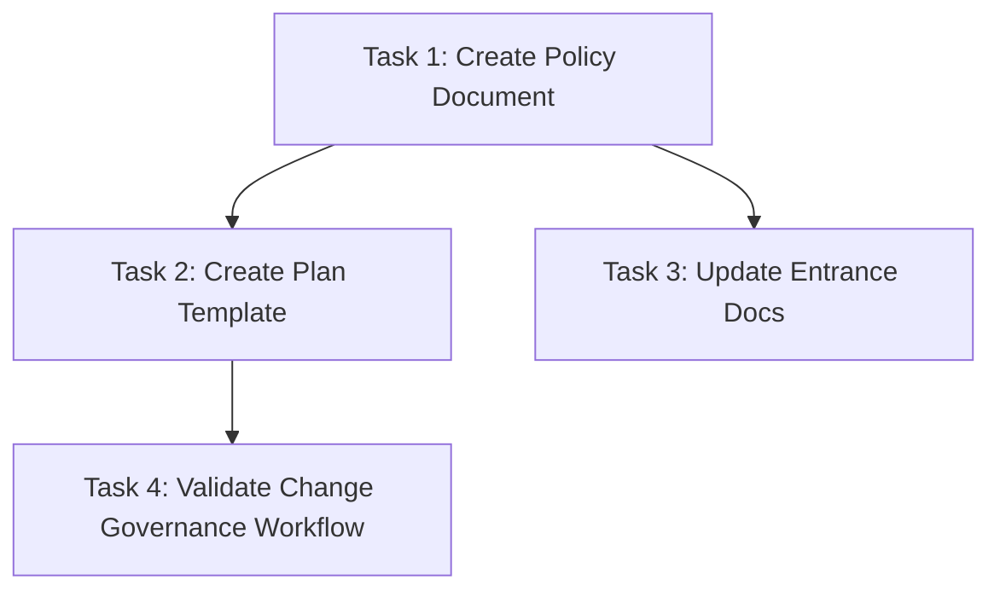

# Approved Execution Contract (Version 1.0)
# Sprint 003 — Engineering Change Governance

## Document Metadata

* **Title**: Sprint 003 — Engineering Change Governance Approved Execution Contract
* **Version**: 1.0
* **Status**: Approved
* **Based On**: docs/sprints/sprint_003_engineering_change_governance.md
* **Produced With**: Gemini 3.5 Flash (Medium) / Antigravity 2.0
* **Approval Date**: 2026-06-29

---

## Purpose

This document is the approved execution contract for Sprint 003.

It defines the implementation activities authorized by the approved sprint.

Implementation shall strictly follow this contract.

If implementation cannot follow this contract, implementation shall stop and request approval before introducing any deviation.

---

## 1. Repository Impact Analysis

As defined by the approved sprint scope, Sprint 003 is a documentation-first governance sprint. It excludes automation, pre-commit hooks, CI/CD integrations, and production code changes.

* **Overall Repository Impact**: Low-risk and documentation-only. The repository will receive new policy guidelines and template artifacts, increasing documentation completeness.
* **Runtime Impact**: None. The runtime engine, parser, composer, export manager, and database indices are completely unaffected.
* **Documentation Impact**: Introduces the change governance policy and planning template. Updates project entry points (`README.md`), active status tracking (`docs/current_status.md`), and changelog records (`CHANGELOG.md`).
* **Test Impact**: None. Existing repository validation shall continue to pass. No new tests are added during this sprint as no functional behavior is introduced.

---

## 2. Repository Changes

The following repository changes are required to implement the approved change governance framework under this Approved Execution Contract.

### Files to Create

1. **Change Governance Policy Document**
   * *Path*: `docs/governance/engineering_change_governance_policy.md`
   * *Why*: Formalizes the Class A (behavior-preserving) and Class B (behavior-changing) classification definitions, and lists the canonical TIA-1 to TIA-5 questions. Will follow `docs/architecture_decisions/ADR-DOC-001-documentation-must-be-ai-transferable.md` formatting guidelines to ensure it is AI-transferable.
2. **Implementation Plan Template**
   * *Path*: `docs/templates/implementation_plan_template.md`
   * *Why*: Provides a reusable planning template that mandates TIA fields, ensuring future execution plans explicitly record testing decisions.

### Files to Modify

1. **`docs/sprints/sprint_003_engineering_change_governance.md`**
   * *Why*: Updated in-place during implementation to validate the governance workflow through its own use, recording Sprint 003's own Class A TIA rationale. (In accordance with sprint constraints, no separate sprint record file is created).
2. **`README.md`**
   * *Why*: Updates the "Engineering Governance" section to define Change Governance, link to the new policy, and guide onboarding contributors.
3. **`docs/current_status.md`**
   * *Why*: Appends Change Governance to the list of "Current Stable Foundations" and updates "Current Active Focus" variables.
4. **`CHANGELOG.md`**
   * *Why*: Records the transition and completion of Sprint 003 deliverables.

---

## 3. Task Breakdown

The implementation of Sprint 003 is decomposed into four sequential tasks under this Approved Execution Contract.

### Task 1: Create the Change Governance Policy Document
* **Objective**: Define the Change Classification and TIA workflow rules in `docs/governance/engineering_change_governance_policy.md`.
* **Affected Files**: `docs/governance/engineering_change_governance_policy.md` (Create)
* **Expected Outcome**: A versioned markdown file outlining the rules of governance.
* **Completion Criteria**: 
  * Complies with `docs/architecture_decisions/ADR-DOC-001-documentation-must-be-ai-transferable.md` (Purpose, Context, Decision, Rationale, Examples, Counter Examples, Implications, Open Questions).
  * Includes the exact definitions of Class A and Class B changes with examples.
  * Contains the five canonical TIA questions (TIA-1: What behavior is changing?, TIA-2: Existing tests?, TIA-3: Sufficiency?, TIA-4: If insufficient, why?, TIA-5: Decision conclusion).

### Task 2: Create the Standardized Implementation Plan Template
* **Objective**: Create the planning template at `docs/templates/implementation_plan_template.md` that enforces TIA structure.
* **Affected Files**: `docs/templates/implementation_plan_template.md` (Create)
* **Expected Outcome**: A markdown template file containing placeholder blocks for TIA questions.
* **Completion Criteria**: 
  * The template includes a dedicated "Testing Impact Analysis" section.
  * Contains placeholders for Class A engineering rationale and Class B TIA-1 to TIA-5 questions.

### Task 3: Apply Repository Documentation Updates
* **Objective**: Update README, current status, and CHANGELOG to integrate the governance workflow.
* **Affected Files**: `README.md`, `docs/current_status.md`, `CHANGELOG.md` (Modify)
* **Expected Outcome**: Project entry guides and metadata history updated.
* **Completion Criteria**: 
  * Hyperlinks to the new policy are verified.
  * `README.md` describes the classification rules and TIA steps under "Engineering Governance".
  * `docs/current_status.md` and `CHANGELOG.md` updated without contradictions.

### Task 4: Validate the Change Governance Workflow (Dogfooding)
* **Objective**: Validate the newly defined change governance workflow through its own manual application on Sprint 003 deliverables.
* **Affected Files**: `docs/sprints/sprint_003_engineering_change_governance.md` (Modify)
* **Expected Outcome**: The Sprint 003 document is updated in-place with its completed Class A TIA and workflow verification results.
* **Completion Criteria**: 
  * Appends the Class A (Behavior-Preserving Change) TIA rationale and verification results.
  * Contains confirmation of successful manual validation of the governance workflow.

---

## 4. Task Dependencies

The tasks follow a strict linear dependency chain to ensure templates and status documents map to the policy rules defined in Task 1:



* **Task 1** is the root dependency. Tasks 2 and 3 require the policy definitions to be finalized first.
* **Task 4** is the terminal validation task. It depends on the template created in Task 2.

---

## 5. Validation Plan

Validation for Sprint 003 is strictly manual and focuses on documentation and workflow consistency.

### Documentation Consistency
* **Action**: Cross-reference `docs/governance/engineering_change_governance_policy.md`, `docs/templates/implementation_plan_template.md`, `docs/sprints/sprint_003_engineering_change_governance.md`, `README.md`, and `docs/current_status.md` to ensure they use the exact same terminology (e.g. "Class A", "Class B", "TIA-1" through "TIA-5") and link structure.
* **Criterion**: No contradictory terms or dead links.

### Repository Validation
* **Action**: Run `pytest` before and after modifying documentation.
* **Criterion**: Existing repository validation shall continue to pass cleanly, confirming zero impact on functional libraries.

### Governance Verification (Manual Walkthrough)
* **Action 1 (Class A change)**: Manually walk through a mock change (such as a docstring typo fix), classify it under Class A, and write a brief engineering rationale. Verify it satisfies Class A rules.
* **Action 2 (Class B change)**: Manually walk through a mock Class B change (such as modifying query parameters in the repository manager), classify it under Class B, and fill out answers for TIA-1 to TIA-5. Verify that a reviewer can explicitly evaluate the testing decision.
* **Criterion**: The steps can be completed manually by an independent contributor using only the documentation.

---

## 6. Rollback Plan

Since all deliverables are documentation additions or minor text edits, rollback is low-risk:

* **Level 1: Revert a Single Task**
  * Use git to discard edits to modified files:
    ```bash
    git restore README.md docs/current_status.md CHANGELOG.md docs/sprints/sprint_003_engineering_change_governance.md
    ```
  * Delete newly created documentation files:
    ```bash
    rm docs/governance/engineering_change_governance_policy.md docs/templates/implementation_plan_template.md
    ```
* **Level 2: Revert Sprint 003**
  * Revert the repository to the pre-Sprint 003 commit hash:
    ```bash
    git reset --hard <pre-sprint-003-commit-hash>
    ```
  * Delete any newly created governance or template documents.

* **Level 3: Rollback Governance Adoption While Preserving Repository Integrity**
  * If the governance framework is decommissioned in the future:
    * Delete the policy and template files.
    * Revert modifications to `README.md` and `docs/current_status.md` that mention Change Triage or TIA requirements.
    * All production code under `src/` and tests under `tests/` remain untouched and intact.

---

## 7. Risk Assessment

### Implementation Risks
* **Risk**: Conflict during the merge of documentation updates.
* **Mitigation**: Perform a git pull prior to staging documentation updates.

### Governance Risks
* **Risk**: Contributors write superficial or copy-pasted responses in the TIA section to bypass reasoning (the "rubber stamp" effect).
* **Mitigation**: The governance policy explicitly states that PR reviewers must check TIA responses against the code and reject the PR if the analysis is generic or insufficient.

### Documentation Risks
* **Risk**: Outdated links or stale documentation paths.
* **Mitigation**: The validation plan includes a manual hyperlink audit before declaring completion.
